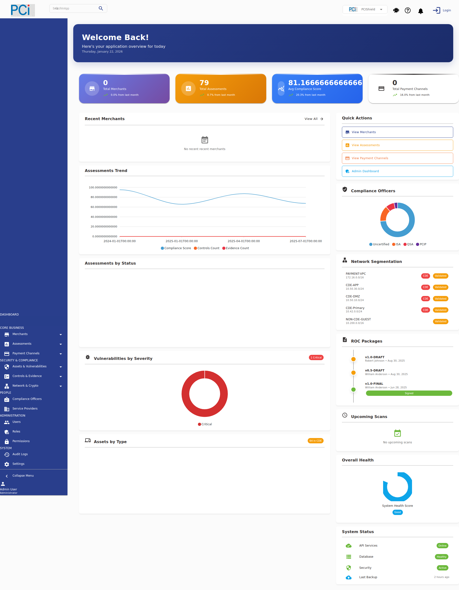
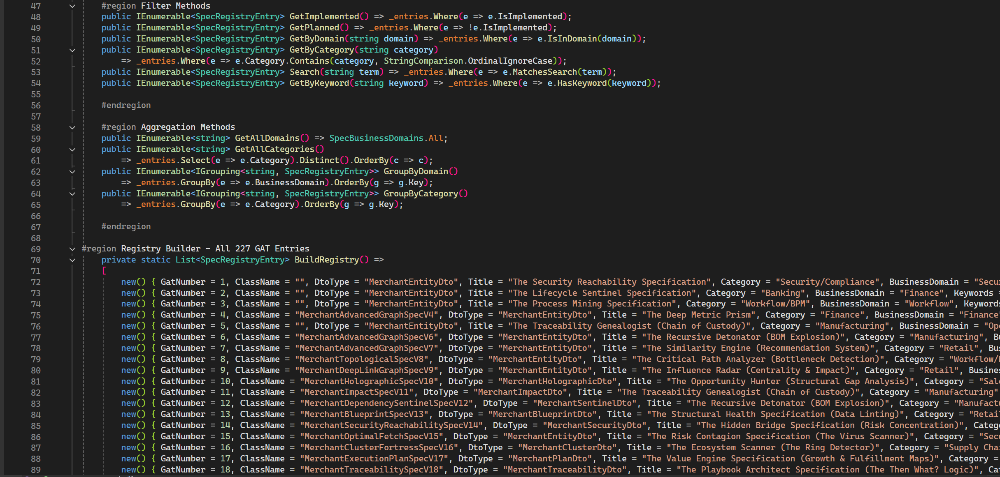
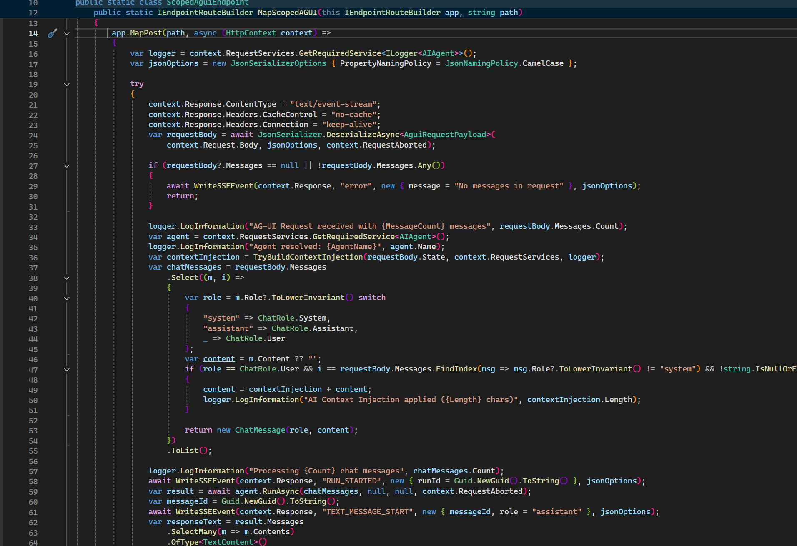
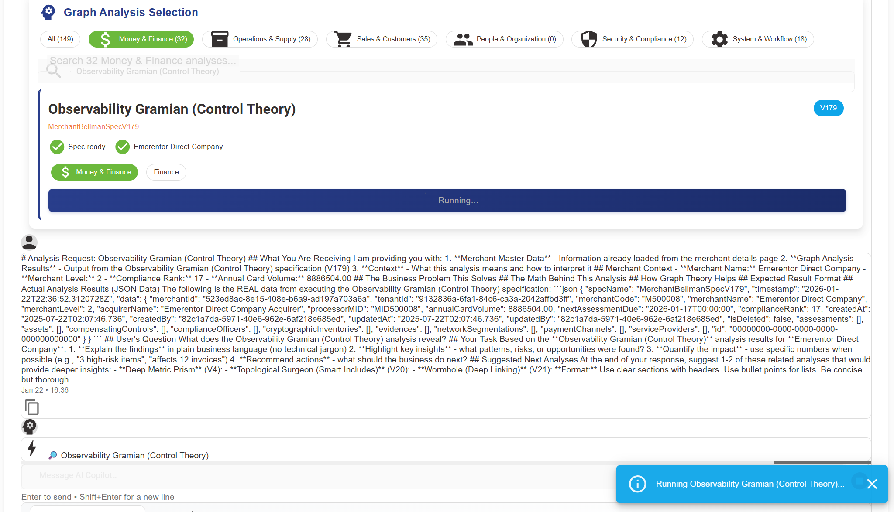
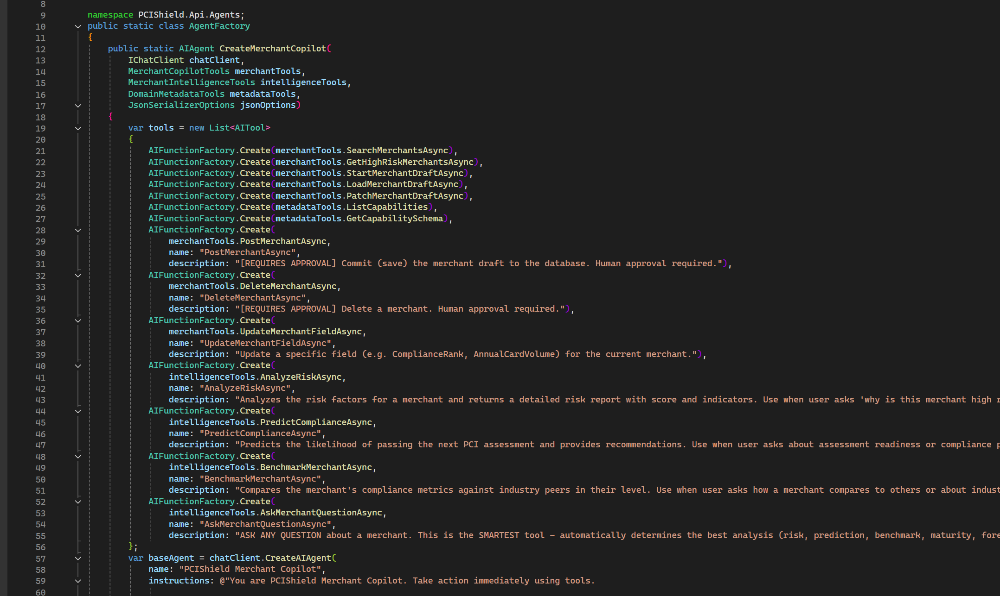
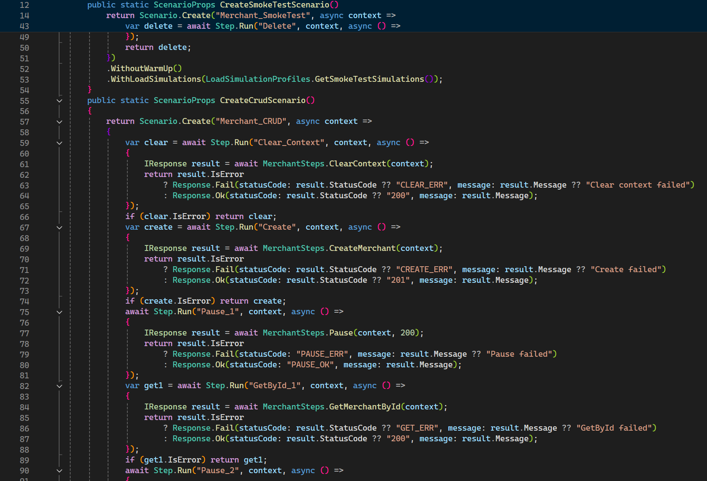
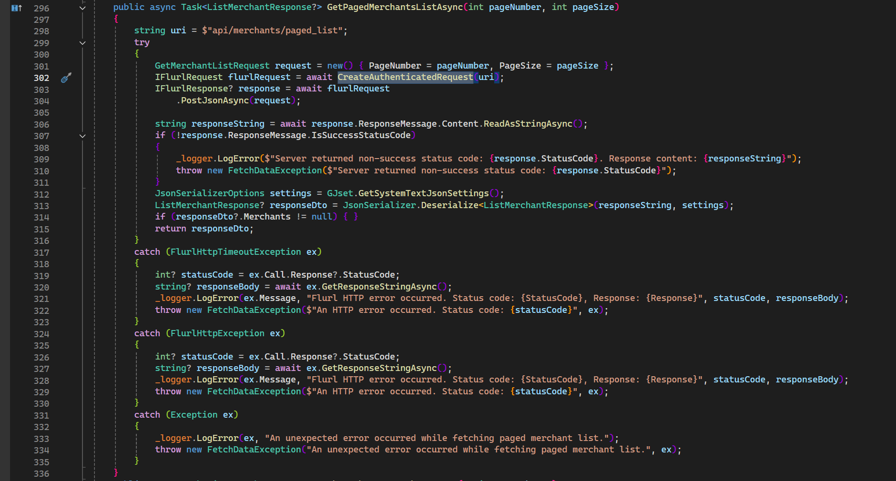

# 🛡️ PCIShield - PCI Compliance Management System

> **A comprehensive PCI-DSS compliance management platform built with Clean Architecture, Domain-Driven Design, and modern .NET technologies.**

[](https://dotnet.microsoft.com/)
[](https://blazor.net/)
[](LICENSE)
[](https://www.pcisecuritystandards.org/)

---

## 📸 Screenshots

### System Overview

*PCIShield compliance management system - production verified*

### Application Architecture (Visual Studio)

*Clean Architecture project structure in Visual Studio*

### Domain Model & Code Structure

*Domain-Driven Design implementation with aggregates and entities*

### UI Components (Blazor + MudBlazor)

*Modern Blazor WebAssembly interface with Material Design*

### Database & Entity Framework

*Entity Framework Core configuration and migrations*

### Additional Views

*Specification Pattern implementation*


*CQRS Command/Query handlers*

---

## 🎯 What This System Does

PCIShield helps organizations achieve and maintain **PCI-DSS compliance** by providing:

| Feature | Description |
|---------|-------------|
| 🏪 **Merchant Management** | Track multiple merchants, their payment channels, and compliance status |
| 📋 **Assessment Tracking** | Manage SAQ (Self-Assessment Questionnaire) and ROC (Report on Compliance) assessments |
| 🔐 **Control Management** | Map and track 300+ PCI-DSS controls across 12 requirements |
| 📎 **Evidence Collection** | Upload and organize compliance evidence with audit trails |
| 🔍 **Vulnerability Scanning** | Integrate scan results and track remediation |
| 📊 **Compliance Scoring** | Real-time compliance percentage calculations |
| 📈 **Reporting** | Generate compliance reports for auditors and stakeholders |

---

## 🏗️ Architecture Overview

This project demonstrates **enterprise-grade architecture patterns**:

```
┌─────────────────────────────────────────────────────────────────┐
│                        PRESENTATION LAYER                        │
│  ┌─────────────────┐  ┌─────────────────┐  ┌─────────────────┐  │
│  │  Blazor WASM    │  │   REST API      │  │   Background    │  │
│  │  (MudBlazor)    │  │  (FastEndpoints)│  │   Jobs          │  │
│  └────────┬────────┘  └────────┬────────┘  └────────┬────────┘  │
└───────────┼────────────────────┼────────────────────┼───────────┘
            │                    │                    │
┌───────────▼────────────────────▼────────────────────▼───────────┐
│                       APPLICATION LAYER                          │
│  ┌─────────────────┐  ┌─────────────────┐  ┌─────────────────┐  │
│  │   Commands      │  │    Queries      │  │  Specifications │  │
│  │   (MediatR)     │  │   (MediatR)     │  │   (Ardalis)     │  │
│  └────────┬────────┘  └────────┬────────┘  └────────┬────────┘  │
└───────────┼────────────────────┼────────────────────┼───────────┘
            │                    │                    │
┌───────────▼────────────────────▼────────────────────▼───────────┐
│                         DOMAIN LAYER                             │
│  ┌─────────────────┐  ┌─────────────────┐  ┌─────────────────┐  │
│  │   Aggregates    │  │  Domain Events  │  │  Value Objects  │  │
│  │   (21 roots)    │  │                 │  │                 │  │
│  └─────────────────┘  └─────────────────┘  └─────────────────┘  │
└─────────────────────────────────────────────────────────────────┘
            │
┌───────────▼─────────────────────────────────────────────────────┐
│                     INFRASTRUCTURE LAYER                         │
│  ┌─────────────┐  ┌─────────────┐  ┌─────────────┐  ┌─────────┐ │
│  │ SQL Server  │  │    Redis    │  │  RabbitMQ   │  │ Logging │ │
│  │ (EF Core)   │  │  (Cache)    │  │ (Messages)  │  │(Serilog)│ │
│  └─────────────┘  └─────────────┘  └─────────────┘  └─────────┘ │
└─────────────────────────────────────────────────────────────────┘
```

### Domain Model (21 Aggregates)

```
MerchantAggregate (Root)
├── AssessmentAggregate
│   ├── AssessmentControlAggregate
│   └── EvidenceAggregate
├── AssetAggregate
│   └── AssetControlAggregate
├── CompensatingControlAggregate
├── ComplianceOfficerAggregate
├── ControlAggregate
├── CryptographicInventoryAggregate
├── NetworkSegmentationAggregate
├── PaymentChannelAggregate
│   └── PaymentPageAggregate
├── ServiceProviderAggregate
├── VulnerabilityAggregate
│   └── VulnerabilityRankAggregate
├── ROCPackageAggregate
├── ScanScheduleAggregate
├── AuditLogAggregate
└── AuthAggregate
```

---

## 🔧 Technology Stack

### Backend (.NET 9)

| Category | Technologies |
|----------|--------------|
| **Framework** | ASP.NET Core 9.0, C# 12 |
| **API** | FastEndpoints, Swagger/OpenAPI, MediatR (CQRS) |
| **Data Access** | Entity Framework Core 9.0, Dapper |
| **Database** | SQL Server (primary), Redis (caching) |
| **Messaging** | RabbitMQ for event-driven architecture |
| **Security** | ASP.NET Core Identity, JWT, BCrypt, FluentValidation |
| **Observability** | Serilog, OpenTelemetry |

### Frontend (Blazor)

| Category | Technologies |
|----------|--------------|
| **Framework** | Blazor WebAssembly / Server |
| **UI Library** | MudBlazor (Material Design) |
| **State** | Reactive Extensions (Rx.NET) |
| **Real-time** | SignalR (WebSocket) |

### Infrastructure

| Category | Technologies |
|----------|--------------|
| **Containers** | Docker, Docker Compose |
| **Proxy** | HAProxy, Nginx |
| **CI/CD** | GitHub Actions |

---

## 📁 Project Structure

```
PCIShieldSolution/
├── src/
│   ├── PCIShield.Domain/           # Domain entities, aggregates, events
│   ├── PCIShield.Application/      # Commands, queries, specifications
│   ├── PCIShield.Infrastructure/   # EF Core, repositories, external services
│   ├── PCIShield.API/              # FastEndpoints REST API
│   └── PCIShield.Blazor/           # Blazor WebAssembly UI
├── tests/
│   ├── PCIShield.UnitTests/
│   ├── PCIShield.IntegrationTests/
│   └── PCIShield.ArchTests/        # Architecture enforcement tests
└── docker/
    ├── docker-compose.yml
    └── Dockerfile.*
```

---

## 🚀 Getting Started

### Prerequisites

- .NET 9.0 SDK
- SQL Server 2019+ (or LocalDB)
- Docker (optional, for containerized deployment)
- Node.js 18+ (for tooling)

### Quick Start

```bash
# Clone the repository
git clone https://github.com/OscarAgreda/PCIShieldSolutionPublic.git
cd PCIShieldSolutionPublic

# Restore dependencies
dotnet restore

# Update database
dotnet ef database update --project src/PCIShield.Infrastructure

# Run the API
dotnet run --project src/PCIShield.API

# Run the Blazor UI (separate terminal)
dotnet run --project src/PCIShield.Blazor
```

### Docker Deployment

```bash
# Build and run all services
docker-compose up --build

# Services available at:
# - API: http://localhost:5000
# - Blazor UI: http://localhost:5001
# - SQL Server: localhost:1433
```

---

## 📊 Key Metrics

| Metric | Value |
|--------|-------|
| **Domain Aggregates** | 21 |
| **Database Tables** | 50+ |
| **Specification Queries** | 80+ reusable query specifications |
| **API Endpoints** | 60+ REST endpoints |
| **Code Coverage** | Target: 80%+ |

---

## 🎓 Learning Outcomes

This project demonstrates:

✅ **Clean Architecture** - Separation of concerns with dependency inversion  
✅ **Domain-Driven Design** - Aggregates, entities, value objects, domain events  
✅ **CQRS Pattern** - Command/Query separation with MediatR  
✅ **Specification Pattern** - Reusable, composable query logic  
✅ **Event-Driven Architecture** - RabbitMQ message-based communication  
✅ **Modern .NET** - Latest C# features, nullable reference types, records  
✅ **Blazor SPA** - Component-based UI with WebAssembly  
✅ **Enterprise Patterns** - Repository, Unit of Work, Factory, Strategy  

---

## 🔒 PCI-DSS Coverage

This system helps track compliance across all **12 PCI-DSS Requirements**:

| Req # | Requirement | Features |
|-------|-------------|----------|
| 1 | Network Security Controls | Network segmentation tracking |
| 2 | Secure Configurations | Asset configuration management |
| 3 | Protect Account Data | Cryptographic inventory |
| 4 | Encrypt Transmission | Payment channel security |
| 5 | Malware Protection | Vulnerability scanning integration |
| 6 | Secure Development | Change control tracking |
| 7 | Access Control | Role-based access management |
| 8 | User Identification | Authentication & audit logs |
| 9 | Physical Security | Asset location tracking |
| 10 | Logging & Monitoring | Comprehensive audit trails |
| 11 | Security Testing | Scan schedule management |
| 12 | Security Policies | Policy document management |

---

## 🤝 About This Project

This is the **open-source training version** of PCIShield. It demonstrates enterprise architecture patterns and PCI compliance domain knowledge.

**Note:** A more feature-rich version with AI capabilities exists privately. This public version focuses on:
- Clean Architecture fundamentals
- Domain-Driven Design patterns
- PCI-DSS domain modeling
- Modern .NET development practices

---

## 📄 License

This project is licensed under the MIT License - see the [LICENSE](LICENSE) file for details.

---

## 👨‍💻 Author

**Oscar Agreda**  
Enterprise Software Consultant | PCI Compliance & ERP Systems Developer

- 🔗 [LinkedIn](https://www.linkedin.com/in/intloagr/)
- 💻 [GitHub](https://github.com/OscarAgreda)
- 📧 Available for consulting engagements

---

> 💡 **Interested in the full-featured version?** Contact me to discuss enterprise licensing and AI-powered compliance features.
